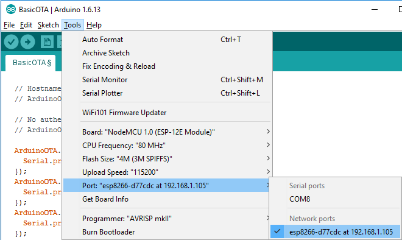
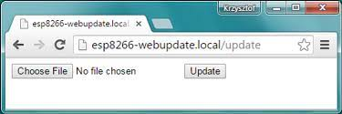

# ESP8266 Arduino OTA Frameworks

This repository contains three types of Over-The-Air (OTA) firmware update frameworks for ESP8266 microcontrollers using the Arduino platform.

## Table of Contents

- [Introduction to OTA](#introduction-to-ota)
- [Arduino OTA Frameworks](#arduino-ota-frameworks)
  - [Basic OTA](#basic-ota)
  - [OTA Web Updater](#ota-web-updater)
  - [Cloud-based OTA](#cloud-based-ota)

## Introduction to OTA

Over-The-Air (OTA) updates provide a convenient way to remotely update firmware on IoT devices without requiring physical access. This is particularly useful for devices deployed in the field where updating firmware through traditional methods may be impractical.

Key benefits of OTA updates include:

- **Remote Updates:** Firmware updates can be delivered and applied remotely, eliminating the need for physical access to devices.
  
- **Reduced Downtime:** OTA updates can be performed without interrupting the normal operation of the device, reducing downtime and improving user experience.

- **Efficiency:** OTA updates can be scheduled or triggered based on specific events, ensuring efficient use of resources and network bandwidth.

## Arduino OTA Frameworks

### Basic OTA

The Basic OTA framework is a simple implementation for performing firmware updates over the air.

Arduino IDE has the utility called network port.

Instead of using physical port throuugh UART it uses Network port.

Limitations: It is dependent on Arduino IDE and works only on local network.

To use the Basic OTA framework, follow the instructions in the [Basic OTA directory](.OTA/Basic_OTA).

### OTA Web Updater

The OTA Web Updater framework enhances the OTA experience by providing a web interface for managing firmware updates. Users can upload firmware files through a web page hosted on the ESP8266, simplifying the update process.

Advantage: You do not rely on IDE because web page.
Limitation: It only works on local network.

To use the OTA Web Updater framework, follow the instructions in the [OTA_Web_Updater directory](.OTA/WebUpdater).

### Cloud-based OTA

The Cloud-based OTA framework extends OTA capabilities by integrating with cloud platforms such as AWS, Microsoft Azure, or custom websites. This enables firmware updates triggered by cloud events or schedules.

To use the Cloud-based OTA framework, follow the instructions in the [Cloud_Based_OTA directory](.OTA/OTA_From_Cloud).

**Note:** Ensure that you have the necessary credentials and configurations for your chosen cloud platform before using the Cloud-based OTA framework.

## Contribution

Feel free to contribute to this repository by creating issues or submitting pull requests. Your feedback and contributions are highly appreciated!

## License

This project is licensed under the [MIT License](LICENSE).

